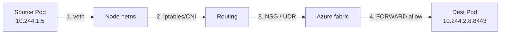

# AKS Network Capture

Capture packet-level evidence on AKS when read-only diagnostics are inconclusive. Use this to prove *where* a packet is dropped — inside the pod, on the node, at an NSG, on a route, or at the Azure load balancer.

This is an escalation tool. For most networking symptoms (DNS, connectivity, ingress 502s), start with `aks-troubleshooting`; come here when you need a pcap or wire-level proof.

## Safety model

Packet capture requires elevated node access, so these scripts are built to be safe by construction:

- **No shell injection.** User-supplied filters and targets are validated against strict allowlists, passed to `tcpdump` as a single trailing argument (never a shell string), and compile-checked in-pod with `tcpdump -d`. There is no `eval`. A negative regression test (`evals/tests/aks-network-capture/injection.test.sh`) proves malicious inputs are rejected.
- **Least privilege.** Capture pods use `NET_ADMIN` + `NET_RAW` (plus `SYS_ADMIN`/`SYS_CHROOT` to use the node's own `tcpdump`) — **not** `privileged`, and never `hostPID`.
- **Pinned images.** All container images are Microsoft Container Registry references pinned by digest; no Docker Hub `:latest`.

> Not yet validated on a live cluster in CI. Before relying on distributed capture in production, run the live-cluster smoke test — `evals/tests/aks-network-capture/smoke-live-cluster.sh` — against a throwaway AKS cluster you control (it creates a short capture, retrieves it, and asserts a non-empty pcap came back).

## Two capture methods

**1. Ad-hoc, single node — Microsoft's documented `kubectl debug node` method (least setup).**
Uses the node's own `tcpdump` via an ephemeral debug pod with only `NET_ADMIN`:

```bash
# find the node hosting the target pod
kubectl get pod <pod> -n <ns> -o wide
# capture on that node, narrowed to the pod IP
kubectl debug node/<node> -it --profile=netadmin \
  --image=mcr.microsoft.com/cbl-mariner/busybox:2.0 \
  -- chroot /host tcpdump -i any host <pod-ip> -w /tmp/pod.pcap
```

**2. Unattended / multi-node — the capture Job scripts (this skill).**

| Script | Purpose |
|--------|---------|
| `scripts/setup-capture-configmap.sh` | Deploy the static-collection script to the cluster (run once) |
| `scripts/create-capture.sh` | Start a bounded capture Job on the selected nodes/pods |
| `scripts/retrieve-captures.sh` | Pull capture bundles off the nodes and clean up |
| `scripts/generate-test-traffic.sh` | Drive test traffic from a pod's netns while capturing |
| `scripts/collect-azure-network-info.sh` | Collect the Azure-side network config for the cluster |
| `scripts/collect-network-info.sh` | Static in-node network state (runs inside capture Jobs) |

```bash
# Capture DNS traffic across all Linux nodes for 2 minutes
./scripts/create-capture.sh --name dns-debug --tcpdump-filter "udp port 53" --duration 120s

# Capture for specific pods (resolves each pod to its host node and narrows to the pod IPs)
./scripts/create-capture.sh --name frontend --pod-selector "app=frontend" --namespace production

# Retrieve and clean up
./scripts/retrieve-captures.sh --name dns-debug
```

`create-capture.sh` targeting flags: `--node-selector`, `--node-names`, `--pod-selector`, `--pod-names` (with `--namespace`). Capture flags: `--duration` (max 30m), `--packet-size`, `--tcpdump-filter`. The filter must be a plain BPF expression — no flags, no shell metacharacters.

## Azure-side analysis (AKS)

A dropped packet often dies in the Azure network layer, not in Kubernetes. After (or instead of) a capture, run `scripts/collect-azure-network-info.sh` and check, in order:

- **NSG** — rules on the node subnet and NICs. Effective rules: `az network nic list-effective-nsg --ids <node-nic-id>`.
- **Routes / UDR** — user-defined routes that redirect or blackhole traffic. Effective: `az network nic show-effective-route-table --ids <node-nic-id> -o table`.
- **Azure Firewall** — if egress is forced through a firewall via UDR.
- **VNET peering** — for cross-VNET flows.
- **Load balancer** — backend pools and health-probe path/port for inbound Services.
- **Service / private endpoints** — for reaching Azure PaaS (SQL, Storage, Key Vault).
- **Private DNS** — the script enumerates zones subscription-wide, because a zone linked to the cluster VNET frequently lives in a *different* resource group than the cluster.

### Egress to Azure PaaS fails (Azure SQL, Storage, Key Vault)

When pod-to-pod (east-west) traffic works but egress to external Azure services fails, the fault is almost always in the **Azure network layer**, not the cluster CNI. Investigate in order, before concluding it is DNS:

1. **NSG rules on the node subnet (and NIC)** — outbound `Deny` rules blocking the destination port/service tag (`Sql`, `Storage`, `AzureCloud`). Most common cause; inspect first.
2. **Route tables / UDR** — a `0.0.0.0/0` route to a firewall/NVA can black-hole or redirect PaaS-bound traffic. Confirm the effective routes on the subnet.
3. **Service / private endpoints** — verify the service endpoint is enabled on the subnet, or that the private endpoint's DNS resolves to the private IP and the NSG/route path to it is open.
4. **Azure Firewall / NVA** — if egress is forced through the firewall, confirm an application/network rule allows the destination FQDN or service tag.
5. **DNS** — only after the above, confirm the FQDN resolves to the intended (public vs. privatelink) endpoint.

`scripts/collect-azure-network-info.sh` gathers the NSG rules, route tables, firewall config, and endpoint state to identify which layer blocks the flow.

## Successful vs. broken flow

When you have the pcap and the Azure config, map the path and mark where it breaks:



Highlight the first hop where the packet is absent in the capture or denied by an NSG/route rule — that is the failure domain.

## Analysis checklist

1. Extract the retrieved tarballs; read the `network-info-*.txt` static state.
2. Open the pcap (`tcpdump -r <file>`); confirm whether the traffic was seen at all.
3. Cross-reference with the Azure network config (`collect-azure-network-info.sh` output).
4. If the pcap is empty, drive traffic with `generate-test-traffic.sh` during a fresh capture.
5. Report the failure domain and the evidence (the exact rule, route, or missing hop).
