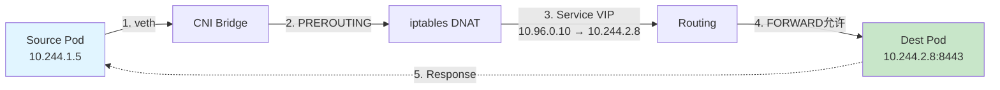
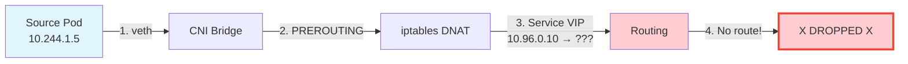

# Network Troubleshoot Skill

Diagnose Kubernetes and Azure networking issues by capturing network packets, collecting static network information across cluster nodes, analyzing Azure network resources, and identifying root causes.

## What This Skill Does

### Kubernetes Network Analysis
- Creates distributed packet capture jobs on Kubernetes Linux nodes
- Supports advanced filtering: IP addresses, ports, tcpdump/BPF filters
- Collects static network information alongside packet captures:
  - IP configuration and routes
  - iptables/nftables rules
  - Connection tracking state
  - Network statistics and neighbor tables
- Outputs results to host filesystem, then copies to agent workspace and cleans up host files

### Azure Network Analysis (for AKS clusters)
When troubleshooting AKS clusters, also analyze Azure network resources that may impact connectivity:
- **Network Security Groups (NSG)**: Check NSG rules on subnets and NICs that may block traffic
- **Route Tables**: Verify user-defined routes (UDR) that may redirect or drop traffic
- **Azure Firewall**: Check firewall rules if traffic goes through Azure Firewall
- **VNET Peering**: Verify peering configuration for cross-VNET communication
- **Load Balancer**: Check backend pools, health probes, and load balancing rules
- **Service Endpoints / Private Endpoints**: Verify connectivity to Azure services
- **DNS Configuration**: Check private DNS zones and resolution paths

### Egress to Azure PaaS Fails (e.g., Azure SQL, Storage, Key Vault)

When pod-to-pod (east-west) traffic works but egress to external Azure services
fails, the fault is almost always in the **Azure network layer**, not the cluster
CNI. Investigate all of the following, in order, before concluding it is DNS:

1. **NSG rules on the node subnet (and NIC)** — check for outbound `Deny` rules
   that block the destination port/service tag (e.g., `Sql`, `Storage`,
   `AzureCloud`). This is the most common cause; always inspect it first.
2. **Route tables / user-defined routes (UDR)** — a `0.0.0.0/0` route to a
   firewall/NVA appliance can black-hole or redirect PaaS-bound traffic. Confirm
   the effective routes on the subnet.
3. **Service endpoints / private endpoints** — verify the service endpoint is
   enabled on the subnet, or that the private endpoint's DNS resolves to the
   private IP and the NSG/route path to it is open.
4. **Azure Firewall / NVA** — if egress is forced through Azure Firewall, confirm
   an application/network rule allows the destination FQDN or service tag.
5. **DNS** — only after the above, confirm the FQDN resolves to the intended
   (public vs. privatelink) endpoint.

Run `scripts/collect-azure-network-info.sh` to gather NSG rules, route tables,
firewall config, and endpoint state, then report which layer blocks the flow.

## How to Use This Skill

- `scripts/setup-capture-configmap.sh` — deploy network collection scripts to cluster (run once)
- `scripts/create-capture.sh` — create a network capture job with filters
- `scripts/retrieve-captures.sh` — retrieve captures from nodes to workspace and cleanup
- `scripts/generate-test-traffic.sh` — generate test traffic from pod's network namespace
- `scripts/collect-network-info.sh` — static network collection script (runs in capture jobs)
- `scripts/collect-azure-network-info.sh` — collect Azure network resource configuration for AKS clusters

## Quick Start

```bash
# Capture all traffic on a specific node for 60 seconds
./scripts/create-capture.sh --node-selector "kubernetes.io/hostname=node-1" --duration 60s

# Capture traffic to/from specific IP and port
./scripts/create-capture.sh --include-filter "10.244.0.5:80" --duration 30s --output-dir /captures

# Capture DNS traffic across all Linux nodes
./scripts/create-capture.sh --tcpdump-filter "udp port 53" --duration 120s --node-selector "kubernetes.io/os=linux"

# Capture traffic for specific pods
./scripts/create-capture.sh --pod-selector "app=frontend" --namespace production --duration 60s

# (Optional) If no traffic detected, generate test traffic from source pod
./scripts/generate-test-traffic.sh --source-pod frontend-abc123 --target backend.default.svc.cluster.local
```

## Capture Workflow

1. **Setup** (one-time) — run `setup-capture-configmap.sh` to deploy scripts to cluster
2. **Identify targets** — determine which nodes or pods need capture
3. **Define filters** — narrow capture scope with IP/port/tcpdump filters
4. **Create capture jobs** — use `create-capture.sh` with appropriate parameters
5. **Monitor jobs** — watch job completion with `kubectl get jobs -l capture-id=<name>`
6. **Retrieve results** — use `retrieve-captures.sh` to copy files to workspace and cleanup
7. **Collect Azure network info** (AKS only) — run `collect-azure-network-info.sh` to gather Azure network resource configurations
8. **Analyze** — analyze pcap files, static network info, and Azure network resources to diagnose the issue
9. **Summarize** — provide summary with capture location and root cause findings

**Optional**: If no traffic is captured (empty pcap) or user requests it, use `generate-test-traffic.sh` while a new capture is running to trigger network requests from the source pod.

## After Retrieval - Analysis and Visualization

After running `retrieve-captures.sh`, you should:

1. **Extract captures** — extract tarball files in the capture directory
2. **Examine network-info files** — read the static network configuration files
3. **Analyze packet captures** — use tcpdump to check if traffic was captured
4. **Collect Azure network info** (for AKS) — run `collect-azure-network-info.sh` to gather:
   - NSG rules on node subnets and NICs
   - Route tables and user-defined routes
   - Azure Firewall rules (if applicable)
   - VNET peering status
   - Load balancer configuration
   - Service/private endpoint configurations
5. **Generate network flow topology diagram** — create a visual representation showing:
   - Source pod/IP and destination pod/IP/service
   - Network path through the stack (pod -> veth -> bridge -> routing -> iptables -> destination)
   - Azure network layer (NSG rules, route tables, VNET boundaries)
   - NAT/DNAT translations (especially for Service IPs)
   - Key decision points (routing tables, iptables chains, NSG rules)
   - **HIGHLIGHT WHERE THE FLOW BREAKS** if traffic is dropped or blocked
   - Use Mermaid diagram format for visualization
6. **Provide summary** — summarize findings:
   - **Where the capture files are stored** (e.g., `network-captures/<capture-name>-<timestamp>/`)
   - Whether traffic was successfully flowing
   - Where the flow breaks (if applicable): missing route, iptables DROP, NSG deny, no listener, etc.
   - Root cause analysis based on both Kubernetes and Azure network topology

### Generating Network Flow Topology Diagrams

When analyzing network flow from source to destination, generate a Mermaid diagram that shows:

**For successful flows:**


**For broken flows, highlight the failure point in RED:**


**Key elements to include in the diagram:**
- Source and destination IPs/ports
- Each hop in the network stack
- NAT translations with before/after IPs
- iptables chains and verdicts (ACCEPT/DROP/REJECT)
- Routing decisions
- Connection tracking state
- **RED highlighting for failure points**
- Annotations explaining why traffic breaks

**Analysis approach:**
1. Read network-info-*.txt files from the capture directory
2. Extract key information:
   - IP addresses and interfaces
   - Routing table entries
   - iptables NAT rules (DNAT/SNAT)
   - iptables filter rules (ACCEPT/DROP)
   - Connection tracking entries
   - Active sockets and listeners
3. Trace the packet flow step by step
4. Identify where the flow succeeds or fails
5. Generate Mermaid diagram with failure points highlighted in RED
6. **Display the diagram directly in your response** - OpenClaw UI will render it automatically
7. Save the diagram to `<capture-dir>/network-topology.md` for reference
8. Provide root cause analysis based on the topology

## Filter Types

### Include/Exclude Filters (Linux only)
- Format: `IP:Port`, `IP`, `Port`, `*:Port`, `IP:*`
- Example: `--include-filter "10.224.0.42:80,10.224.0.33:8080"`
- Example: `--exclude-filter "10.0.0.0/8"`

### TCPdump Filters (BPF)
- Raw tcpdump/BPF syntax
- Example: `--tcpdump-filter "tcp and port 443"`
- Example: `--tcpdump-filter "host 10.0.0.5 and not port 22"`
- See: https://www.tcpdump.org/manpages/pcap-filter.7.html

### Packet Size Limiting
- `--packet-size <bytes>` truncates packets to specified size
- Reduces storage requirements for high-volume captures
- Default: 0 (no limit)

## Static Network Information Collected

**Linux nodes:**
- IP address configuration (`ip -d -j addr show`)
- IP routes and rules (`ip route`, `ip rule`)
- Neighbor table (`ip -d -j neighbor show`)
- iptables rules (`iptables-save`, table dumps)
- Connection tracking (`conntrack -L`)
- Network statistics (`ss -s`, `/proc/net/*`)
- Kernel network config (`/proc/sys/net/*`)

## Output Storage

Captures are written to the node's host filesystem at `/var/log/network-captures` during collection, then:
1. Retrieved to the agent workspace for analysis
2. Host filesystem copies are automatically cleaned up after retrieval

## Target Selection

### Node Selection
```bash
# Single node by name
--node-names "aks-nodepool1-12345-vmss000000"

# Multiple nodes by label
--node-selector "kubernetes.io/os=linux,node-role=worker"
```

### Pod Selection
```bash
# By pod name
--pod-names "frontend-abc123,backend-xyz789" --namespace production

# By label selector
--pod-selector "app=database,tier=backend" --namespace-selector "env=production"
```

## Common Scenarios

- Intermittent connection failures to a service
- DNS resolution issues
- High latency or packet loss
- Egress/ingress traffic analysis
- Security policy troubleshooting

## Gotchas

- **Capture jobs run privileged** — they need host network access and cap_net_raw
- **Storage space** — unfiltered captures on busy nodes can generate GB/minute. Always use filters and limit duration.
- **Performance impact** — packet capture consumes CPU/memory. Avoid capturing on already overloaded nodes.
- **Job cleanup** — completed capture jobs are auto-deleted 1 hour after completion (ttlSecondsAfterFinished: 3600)
- **Node access** — capture pods need to run with hostNetwork and privileged security context
- **Linux only** — currently only Linux nodes are supported

## Troubleshooting

**Capture job fails to start:**
- Check node selector matches existing nodes
- Verify output path is writable
- Check pod security policies / admission controllers

**No packets captured:**
- Verify filters aren't too restrictive
- Check network interface selection (default: all interfaces)
- Ensure target traffic is actually flowing during capture window

**Storage access failures:**
- Ensure sufficient disk space on host path
- Check node filesystem permissions for `/var/log/network-captures`

## Memory

Capture jobs are labeled with `capture-id` and timestamp. Query past captures:

```bash
kubectl get jobs -l app=network-capture --sort-by=.metadata.creationTimestamp
```

Log completed captures for historical reference:

```bash
echo "$(date -u +%Y-%m-%dT%H:%M:%SZ) | capture-name | nodes: <list> | filters: <filters> | findings: <summary>" >> ${SKILL_DATA_DIR:-/tmp}/capture.log
```
